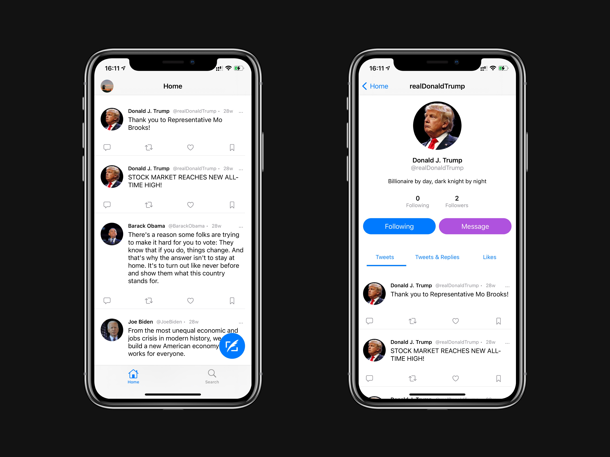

# NeptuneBlog

基于SwiftUI的MicroBlog, 后端部分使用Spring Cloud Netflix开发.

## 项目地址

- 前端 <https://github.com/liuweigeek/NeptuneBlog-frontend>
- 后端 <https://github.com/liuweigeek/NeptuneBlog-backend>
- iOS端 <https://github.com/liuweigeek/NeptuneBlog-iOS>

## 项目截图

## 部署步骤

- Clone后端项目 [NeptuneBlog-backend](https://github.com/liuweigeek/NeptuneBlog-backend)
- 打开后端项目中`user/user-user/src/main/resources/application-dev.yml`, 将`neptune.oss.minio.endpoint`中的`localhost`部分替换为局域网IP，保证在iOS端可以访问到后端图片资源
- 启动后端项目
- 使用Xcode打开本项目并启动

## ❤️ Contributing

